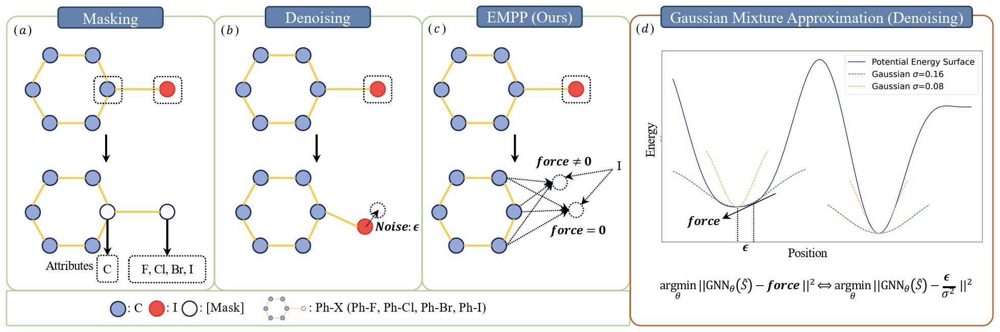
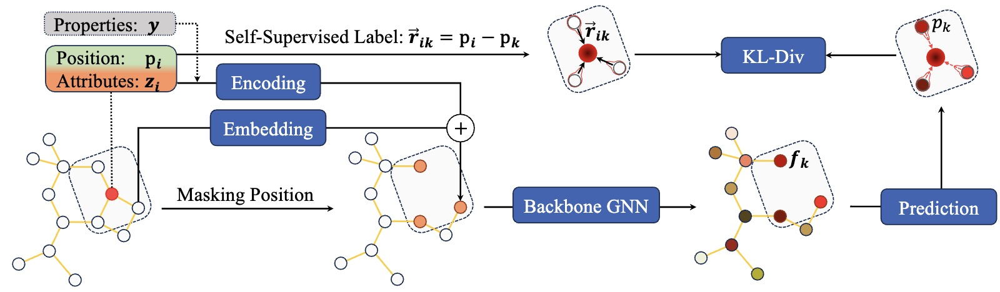

# Equivariant Masked Position Prediction for Efficient Molecular Representation

This is the official code-release for the paper [Equivariant Masked Position Prediction for Efficient Molecular Representation](https://openreview.net/forum?id=Nue5iMj8n6), published at ICLR 2025 (poster).



EMPP is a self-supervised method for 3D molecular representation. In this repository, we provide an application based on EMPP: using it as an auxiliary task to improve property prediction. This application can be applied to both equilibrium and non-equilibrium datasets.



## Environment Setup ##

The implementation of this project is based on the [Equiformer project](https://github.com/atomicarchitects/equiformer?tab=readme-ov-file). See [here](env_setup.md) for setting up the environment. If you want to apply EMPP for other equivariant GNNs, please modify the model according to the pseudocode below.
```python
import torch
class model(nn.Module):
    def __init__(self, ):
        ...
        self.postion_prediction = pos_prediction(irreps_feature, norm, irreps_node_embedding)
    
    def forward(self, data, ssp=False):
        # traditional forward process
        output = self.prediction(data)
        # introduce EMPP
        if ssp:
            # mask position
            EMPP_data_all = self.mask_position(data)
            EMPP_loss = 0
            for EMPP_data in EMPP_data_all:
                # compute the KL-div loss in position prediction
                EMPP_loss = EMPP_loss + self.ssp(EMPP_data)
            return output, EMPP_loss
        return output
    
    def mask_position(self, data):
        ...
        return EMPP_data

    def prediction(self, data):
        ...
        return predicted_properties

    def ssp(self, data):
        ...
        return self.postion_prediction(layer_out)

class model_layer(nn.Module):
    def __init__(self, ):
        ...
        # encoding label values into GNNs (optional, If not in use, ensure that the input is an equilibrium molecule.)
        self.encoding_target = GaussianSmearing()
        # encoding the atomic types of masked atom into GNNs
        self.encoding_masked_atom = Atom_embedding()
    
    def forward(self, data, target=None):
        # If conducting property prediction, target is None. If conducting position prediction, target is a tuple where (label_value, masked_atom_type)
        if target is not None:
            node_embedding += (self.encoding_target(target[0]) + self.encoding_masked_atom(target[1]))[data.batch]
        ...
```

### QM9

The dataset of QM9 will be automatically downloaded when running training. [`main_qm9.py`](main_qm9.py) is the training code for QM9 dataset where the argument `--ssp` represent using EMPP. We also provide training scripts under [`scripts/train/qm9/equiformer`](scripts/train/qm9/equiformer).
For example, we can train EMPP for the task of `alpha` by running:
    ```bash
        sh scripts/train/qm9/equiformer/target@1.sh
    ```
The target number for different regression tasks can be found [here](https://pytorch-geometric.readthedocs.io/en/latest/generated/torch_geometric.datasets.QM9.html#torch_geometric.datasets.QM9).

### GEOM

The dataset of GEOM can be downloaded [here](https://dataverse.harvard.edu/file.xhtml?fileId=4360331&version=2.0). You need to unzip the downloaded file and place the file in directory `data/GEOM/raw/drugs_crude.msgpack`. Besides, please `pip install msgpack`
The GEOM is a large molecular dataset and we random sample `200000/10000` data for training/validation datasets. [`main_geom.py`](main_geom.py) is the training code. You can train EMPP by running:
    ```python main_geom.py --ssp```
Our code supports multi-GPU training. Please use the DDP training command from PyTorch.

### General 

1. [`nets`](nets) includes code of position prediction modules.
2. [`engine`](engine.py) includes code of masking strategies.

## Acknowledgement ##

This research were performed using the CFFF platform of Fudan University. 

## Citation ##

If you use EMPP in your work, please consider citing the following:
```bibtex
@inproceedings{
an2025equivariant,
    title={Equivariant Masked Position Prediction for Efficient Molecular Representation},
    author={Junyi An and Chao Qu and Yun-Fei Shi and XinHao Liu and Qianwei Tang and Fenglei Cao and Yuan Qi},
    booktitle={The Thirteenth International Conference on Learning Representations},
    year={2025},
    url={https://openreview.net/forum?id=Nue5iMj8n6}
}
```

If you use our code where the backbone model is Equiformer, please don't forget to cite the following:
```bibtex
@inproceedings{
    liao2023equiformer,
    title={Equiformer: Equivariant Graph Attention Transformer for 3D Atomistic Graphs},
    author={Yi-Lun Liao and Tess Smidt},
    booktitle={International Conference on Learning Representations},
    year={2023},
    url={https://openreview.net/forum?id=KwmPfARgOTD}
}
```
 

